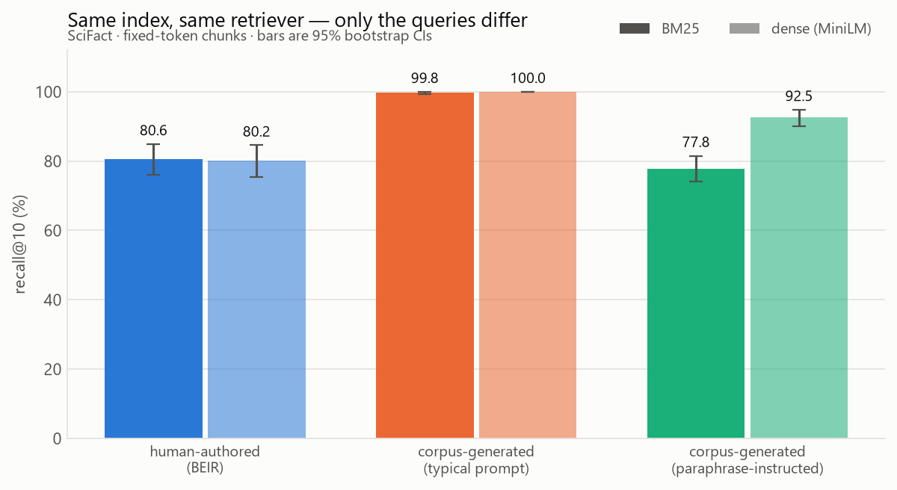

# qrel

[](https://github.com/coen0713/qrel/actions/workflows/ci.yml)
[](tests/test_metrics_parity.py)

A retrieval evaluation harness with contamination detection. It measures how
well a retriever finds the right documents — and, more to the point, whether
your evaluation set is quietly lying to you about that.

## The headline number

**[Read the full writeup →](WRITEUP.md)**

<picture>
  <source media="(prefers-color-scheme: dark)" srcset="results/plots/fig1-conditions-dark.png">
  
</picture>

On SciFact, with the corpus, chunker, retriever, aggregation policy and metric
held identical across conditions — only the origin of the queries varies:

| eval set | n | query–gold overlap | recall@10 (BM25) |
|---|---:|---:|---:|
| **human-authored** (BEIR) | 300 | 0.036 | **80.6** [76.1, 84.9] |
| **corpus-generated**, typical prompt | 492 | 0.098 | **99.8** [99.4, 100.0] |
| **corpus-generated**, vocabulary-controlled prompt | 482 | 0.044 | **77.8** [74.1, 81.5] |

Queries generated the way a typical RAG tutorial generates them retrieve their
own source passage **essentially always**: +19.2 recall@10 points over
human-authored queries on the same index (95% CI [+14.9, +23.7], unpaired
bootstrap, p = 0.0001). The pre-registered threshold for calling this confirmed
was +5 points.

Adding one instruction to the generation prompt — *do not reuse the passage's
vocabulary* — removes the entire effect for BM25 (−2.8 points, CI spans zero)
**and leaves 12.4 points of it intact for a dense retriever.** Paraphrasing
strips the word overlap, not the meaning overlap, so the obvious fix repairs the
eval set for exactly the retriever that needed it least.

The subtler half: within the vocabulary-controlled set, retrievability is still
strongly predicted by residual lexical overlap. Sorting those queries into
overlap deciles gives recall@10 of **49.0** in the lowest and **95.8** in the
highest (Spearman ρ = +0.268 [+0.186, +0.344]). The mean effect is gone; the
mechanism is not.

Full analysis, threats to validity and the ceiling-effect caveat:
[`notes/preregistration.md`](notes/preregistration.md) (written and committed
*before* any query was generated — check the git history) and
[`notes/decisions.md`](notes/decisions.md) D19.

> **Status: complete.** M0–M5 done, every acceptance criterion in
> [PLAN.md](PLAN.md) verified against a run, not a report.

## Why

Most RAG evaluation sets are generated from the corpus they evaluate against.
You prompt an LLM to write questions from passage *P*, mark *P* as the gold
answer, and then measure how often your retriever returns *P*. That validates a
system against the process that produced its own labels. The number goes up, and
what it measures is string overlap rather than retrieval quality.

`qrel` builds the harness that catches that, then uses it to measure how large
the effect actually is.

## Install

```bash
git clone https://github.com/coen0713/qrel && cd qrel
uv venv && uv pip install -e ".[dev]"
```

The core install has no `torch`: BM25 baselines, all metrics, and the whole
contamination module run without it. Add dense retrieval and synthetic query
generation when you need them:

```bash
uv pip install -e ".[dev,dense,llm]"
```

## Worked example

```bash
reval corpus download scifact
reval corpus stats scifact
```

```
                        scifact [test]
  statistic                   value    BEIR paper   check
  documents                   5,183         5,183   match
  queries (judged)              300           300   match
  mean relevant / query         1.1           1.1   match
```

If any row says `MISMATCH`, the loader is wrong and nothing downstream can be
trusted. That is the point of printing the published column next to ours.

## Metric parity

Our `recall@k`, `MRR@k`, and `nDCG@k` are implemented from scratch and checked
against [`pytrec_eval`](https://github.com/cvangysel/pytrec_eval) — the Python
binding for NIST's `trec_eval` — to within `1e-6`, on real run files, across all
three datasets at k ∈ {1, 5, 10, 20, 100}. CI enforces it:

```bash
pytest tests/test_metrics_parity.py
```

This is the highest-credibility artifact in the repo. It is the difference
between "here are my numbers" and "here are my numbers, and here is the proof I
did not make them up."

## Contamination detectors

Three of the four leak types in [PLAN.md](PLAN.md) M3 have detectors; the fourth
is named rather than pretended away.

```bash
reval contaminate score --dataset scifact          # query-gold lexical overlap
reval contaminate dupes --dataset nfcorpus         # MinHash+LSH near-duplicates
reval contaminate experiment -c configs/contamination.yaml   # the whole table
```

Running (b) on the three corpora found real problems, including one the detector
had to be fixed to see:

| corpus | duplicate clusters | touching a judged document |
|---|---:|---:|
| SciFact | 0 | 0 |
| NFCorpus | 41 | **41** |
| FiQA | 73 | 1 |

Every one of NFCorpus's 41 duplicate clusters contains a gold document, which is
the case where duplication actually distorts a metric. FiQA initially reported
890 pairs, but 703 of them came from a single 38-member cluster of *empty*
documents — "near duplicate" is not a meaningful claim about two empty strings.
Excluding them surfaced something better: two of FiQA's empty documents are
judged relevant to a query, making those queries unanswerable and capping recall
for a reason no retriever can fix.

**Not detected:** encoder pretraining contamination. SciFact is plausibly in
`all-MiniLM-L6-v2`'s training data and we cannot resolve that without training an
encoder. It is stated as a threat to validity, which is worth more than
pretending it is not there.

## Hard negatives are mostly not negatives

```bash
reval negatives mine --dataset scifact --retriever bm25
```

Mining hard negatives means taking a retriever's top-ranked documents and
dropping the known positives. BEIR judges 1.1 documents relevant per SciFact
query out of 5,183, so what is left is mostly *unjudged*, not *non-relevant* —
and a good retriever ranked it highly for a reason. Share of documents clearing
the same calibrated relevance bar:

| corpus | retriever | filter AUC | random documents | mined "negatives" | enrichment |
|---|---|---:|---:|---:|---:|
| SciFact | BM25 | 0.982 | 4.9% | **82.1%** | 16.9× |
| SciFact | dense | 0.982 | 4.9% | 75.4% | 15.5× |
| FiQA | BM25 | 0.965 | 5.5% | **95.9%** | 17.4× |
| NFCorpus | BM25 | 0.717 | 33.9% | 89.8% | 2.6× |
| NFCorpus | dense | 0.717 | 33.9% | 84.4% | 2.5× |

One in twenty random documents clears the bar; four in five mined candidates do.
The highest-scoring "negative" is a **rank-1** result for its own query — an
obviously correct answer that nobody labelled:

> **query:** *Macropinocytosis contributes to a cell's supply of amino acids via
> the intracellular uptake of protein.*
> **"negative":** *Macropinocytosis of protein is an amino acid supply route in
> Ras-transformed cells*

So a difficulty-stratified eval subset built from unfiltered hard negatives is
stratified on label noise.

The threshold is **measured, not chosen**: judged-relevant documents scored
against a random background sample, cut at maximum Youden's J, with the AUC
reported so the filter can be disbelieved. It earns that on NFCorpus, which
comes back at AUC 0.717 and prints a warning — in a topically homogeneous
medical corpus a third of *random* documents already look relevant.

## Design decisions worth knowing

- **Tie-breaking is explicit.** Scores tie constantly. The default policy
  reproduces `trec_eval`: score descending, then document id *descending*.
- **Chunk→document aggregation is a named step.** You retrieve chunks; qrels
  judge documents. Max-score-per-document is the default, and it is a function
  you can swap, not an implicit reduction buried in a loop.
- **Nothing is compared without a confidence interval.** Bootstrap CIs over
  queries, paired bootstrap for A-vs-B.
- **Unjudged documents count as non-relevant**, which systematically penalises
  retrievers that surface good-but-unjudged results. That is a threat to
  validity we name rather than paper over.

See [`notes/decisions.md`](notes/decisions.md) for the full log — 25 entries,
including three where the first implementation was wrong and the fix is recorded
with it — and [`CLAUDE.md`](CLAUDE.md) for the rigor rules the repo is held to.

## Reproduce it

```bash
git clone https://github.com/coen0713/qrel && cd qrel
uv venv && uv pip install -e ".[dev,dense]"
reval corpus download
reval contaminate experiment --config configs/contamination.yaml --quick
```

Full commands, including the hour-long grid, are in
[WRITEUP.md](WRITEUP.md#reproduction). The synthetic query sets are committed, so
no API key is needed to reproduce any number here.

## License

MIT
