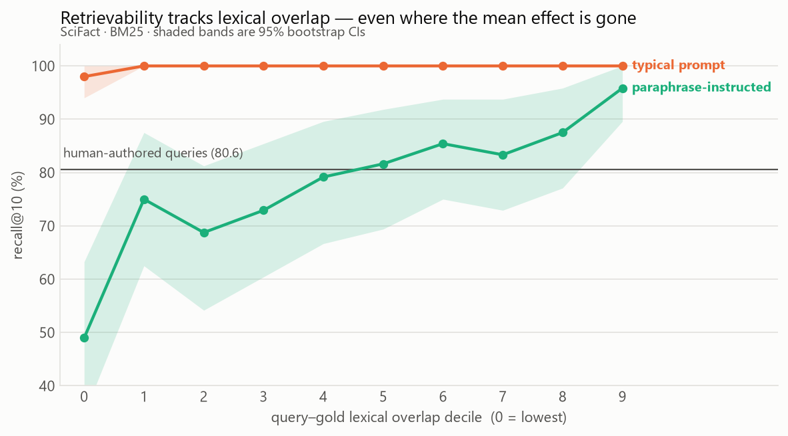
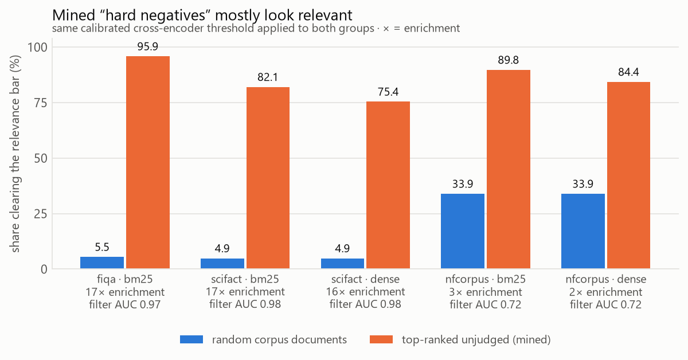

# Corpus-generated evaluation queries overstate recall@10 by 19 points

On SciFact, an evaluation set built the way most RAG projects build one — sample
a passage, prompt an LLM for a question it answers, mark that passage as the
gold answer — reports **recall@10 of 99.8%** where human-authored queries on the
identical index report **80.6%**. The difference is **+19.2 points**
(95% CI [+14.9, +23.7], unpaired bootstrap over queries, p = 0.0001), and it
holds between +17.5 and +19.9 across all eight chunker × retriever
configurations tested. A retriever evaluated that way is not being measured; it
is being asked to recognise the passage its own test set was cut from.

Adding one instruction to the generation prompt — *do not reuse the passage's
vocabulary* — removes the effect entirely for BM25 (−2.8 points, CI spans zero)
**and leaves 12.4 points of it intact for a dense retriever.** Paraphrasing
strips the word overlap, not the meaning overlap, so the fix most practitioners
would reach for repairs the eval set for exactly the retriever that needed it
least.

Three secondary findings, all pre-registered before any data existed:
retrievability tracks lexical overlap strongly within a paraphrased set
(Spearman ρ = +0.268, decile 0 → 9 spanning 49.0% → 95.8%); the ranking of four
chunking strategies is **not** disturbed once confidence intervals are respected;
and, separately, **82% of hard negatives mined from SciFact are not negatives**.

---

## Method

Everything is held fixed except the origin of the queries: one corpus, one
index, one chunker, one retriever, one aggregation policy, one metric
implementation. Configuration lives in [`configs/contamination.yaml`](configs/contamination.yaml)
and [`configs/baseline.yaml`](configs/baseline.yaml); the analysis was
pre-registered in [`notes/preregistration.md`](notes/preregistration.md) and
committed **before** the first synthetic query was generated — the ordering is
checkable in `git log`.

**Conditions.** SciFact (5,183 documents). `human` = BEIR's 300 test queries
with BEIR's judgments. `synth-a` = 492 usable queries from a prompt written the
way RAG tutorials write one. `synth-b` = 482 usable from a prompt that
additionally forbids reusing the passage's wording. Both prompts are in
[`prompts/`](prompts/); both drew from the *same* 500 passages (seed 0), so
A-vs-B compares prompts, not samples. Generation used `claude-opus-5` at low
effort — 1,000 calls, $4.93. The pre-stated exclusion filter dropped empty,
over-long, and declined outputs only (8 and 18 respectively); nothing was
dropped for being too easy.

**Statistics.** The between-condition contrast is **unpaired**. Synthetic and
human queries are different queries with no per-query correspondence, so the
paired bootstrap is invalid here — and at 492 against 300 it would refuse the
inputs anyway. Within-condition contrasts (chunker A vs B on the same queries)
stay paired. Every number carries a 95% bootstrap CI over 10,000 resamples at
seed 0.

**Metrics.** recall@k, MRR@k and nDCG@k are implemented from scratch and checked
against `pytrec_eval` to within 1e-6, per query, at k ∈ {1, 5, 10, 20, 100},
across all three datasets. CI enforces it. Separately, the BM25 baseline
reproduces BEIR's published nDCG@10 closely (SciFact .682 vs .665, NFCorpus .314
vs .325, FiQA .235 vs .236) — the parity test proves the metrics match an
oracle; that agreement proves the pipeline feeding them matches the literature.

---

## Results

### The effect is large, and one prompt instruction removes half of it

<picture>
  <source media="(prefers-color-scheme: dark)" srcset="results/plots/fig1-conditions-dark.png">
  
</picture>

| eval set | n | mean query–gold Jaccard | recall@10, BM25 | recall@10, dense |
|---|---:|---:|---:|---:|
| human-authored | 300 | 0.036 | 80.6 [76.1, 84.9] | 80.2 [75.5, 84.6] |
| corpus-generated, typical prompt | 492 | 0.098 | **99.8** [99.4, 100.0] | **100.0** [100.0, 100.0] |
| corpus-generated, paraphrase-instructed | 482 | 0.044 | 77.8 [74.1, 81.5] | **92.5** [90.0, 94.8] |

The dense column is the one worth staring at. We predicted in advance that BM25
would inflate *more* than a dense retriever, on the reasoning that BM25 scores
lexical overlap directly. That prediction is **refuted**, and the direction is
more interesting than the hypothesis: under the paraphrase prompt BM25 shows no
inflation at all while the dense retriever shows +12.4 points, a gap of −15.2
points that reproduces across every chunker (−14.1 to −18.1).

The mechanism is straightforward once seen. Telling a generator not to reuse the
passage's words removes the surface signal BM25 depends on and leaves the
semantic signal a bi-encoder depends on untouched. The encoder still recognises
the passage it was asked to write about.

### The mechanism is visible where the mean effect is not

<picture>
  <source media="(prefers-color-scheme: dark)" srcset="results/plots/fig2-overlap-gradient-dark.png">
  
</picture>

Sorting each synthetic set into deciles by character 5-gram Jaccard against its
gold passage:

| | decile 0 | decile 9 | Spearman ρ (query-level) |
|---|---:|---:|---:|
| typical prompt | 98.0 | 100.0 | +0.077 [+0.000, +0.134] |
| paraphrase-instructed | 49.0 | 95.8 | **+0.268** [+0.186, +0.344] |

**This is where the pre-registration cost us something, and it should.** The
pre-stated criterion for this hypothesis was ρ > 0 with a CI excluding zero
*and* a top-minus-bottom decile gap ≥ 10 points. On the typical prompt that
returns NULL — but not because the relationship is absent. recall@10 is 100.0 in
nine of ten deciles; the metric is saturated and has no headroom for a gradient
to appear in. The correct reading is "uninformative", not "null", and we formed
that reading *after* seeing the data, which is recorded as a deviation in
[`notes/decisions.md`](notes/decisions.md) D19 along with the criterion we
should have written instead.

On the paraphrased set, where the mean effect is gone, the gradient is
unmistakable: queries in the lowest overlap decile are retrieved 49% of the
time, those in the highest 96%. A paraphrased eval set has a mean that looks
honest and a composition that is not.

Note also that human SciFact queries have the *highest* normalized longest
common substring of the three conditions (0.234, against 0.194 and 0.094).
SciFact claims are often near-verbatim extracts from abstracts. Lexical overlap
with a gold passage is not by itself evidence of contamination — which is
precisely why the comparison has to be against a human control rather than
against an absolute threshold.

### Chunker rankings survive; the reordering is noise

The four chunkers reorder between eval sets (Kendall τ as low as −0.67), but
every chunker pair's confidence intervals overlap under both eval sets, so the
reordering carries no information. Reported as **null**. The closest call was
semantic chunking under the paraphrased set with BM25 (70.1 [66.0, 74.1]) against
the other three (77.8 [74.1, 81.5]) — bounds touching at exactly 74.1, and
therefore not separated. With four strategies whose scores span 0.7 points on
the human set, this test is weak by construction, as the pre-registration said
in advance.

### 82% of mined hard negatives are not negatives

<picture>
  <source media="(prefers-color-scheme: dark)" srcset="results/plots/fig3-false-negatives-dark.png">
  
</picture>

Hard-negative mining takes a retriever's top-ranked documents and drops the known
positives. BEIR judges 1.1 documents relevant per SciFact query out of 5,183, so
what remains is mostly *unjudged*, not *non-relevant*. Scoring both groups with
the same calibrated cross-encoder threshold:

| corpus | retriever | filter AUC | random documents | mined "negatives" | enrichment |
|---|---|---:|---:|---:|---:|
| SciFact | BM25 | 0.982 | 4.9% | **82.1%** | 16.9× |
| SciFact | dense | 0.982 | 4.9% | 75.4% | 15.5× |
| FiQA | BM25 | 0.965 | 5.5% | **95.9%** | 17.4× |
| NFCorpus | BM25 | 0.717 | 33.9% | 89.8% | 2.6× |
| NFCorpus | dense | 0.717 | 33.9% | 84.4% | 2.5× |

One random document in twenty clears the bar; four mined candidates in five do.
Mining selects for unlabelled positives by construction — the better the
retriever, the more of them it hands you. The highest-scoring "negative" is a
rank-1 result for its own query:

> **query:** *Macropinocytosis contributes to a cell's supply of amino acids via
> the intracellular uptake of protein.*
> **"negative":** *Macropinocytosis of protein is an amino acid supply route in
> Ras-transformed cells*

The threshold is measured rather than chosen: judged-relevant documents scored
against a random background sample, cut at maximum Youden's J, with the AUC
reported so the filter can be disbelieved. It should be disbelieved on NFCorpus,
where AUC 0.717 means the cross-encoder barely separates the classes and a third
of *random* documents already clear the bar.

Two adjacent corpus findings. NFCorpus contains 41 near-duplicate document
clusters and **all 41 contain a judged document** — the case where duplication
actually distorts a metric. FiQA contains 73 documents of fewer than five words,
**two of which are gold answers**, making those queries unanswerable and capping
recall for a reason no retriever can fix.

---

## Threats to validity

**Encoder pretraining contamination is unresolved and bites hardest on our most
interesting result.** SciFact is plausibly in `all-MiniLM-L6-v2`'s training data.
Part of the dense retriever's advantage on its own source passages could be
memorisation rather than the semantic-similarity mechanism we claim. Resolving it
would require training an encoder on a corpus we control, which is out of scope
at this scale. We name it rather than pretend otherwise.

**Sparse judgments bias *against* the headline.** The synthetic conditions have
complete gold labels by construction — exactly one correct passage, known. The
human condition loses credit whenever it retrieves a good document nobody judged,
and the M4 result quantifies how often that happens: 82% of its top-ranked
unjudged documents look relevant to a strong cross-encoder. Some fraction of the
+19.2 points is therefore incomplete labelling rather than contamination. This is
the most serious threat to the primary claim. It cannot inflate the effect — it
can only mean the true effect is smaller than measured — but "smaller" is not
quantified here.

**One corpus, one generating model, two prompts.** The headline is measured on
SciFact alone. Three datasets is not "in general", and one corpus certainly is
not. A single LLM wrote every synthetic query; a different model would produce a
different vocabulary-overlap profile.

**The paraphrase prompt is an intervention, not a correction.** A smaller effect
under `synth-b` is evidence about mitigation, not evidence that `synth-a` was
measured wrongly.

**Unjudged documents count as non-relevant** throughout, the standard convention,
which systematically penalises retrievers that surface good-but-unjudged results.

---

## Reproduction

From a clean clone to the headline table. No GPU; no API key except for
regenerating the synthetic queries, which are committed so you do not need to.

```bash
git clone https://github.com/coen0713/qrel && cd qrel
uv venv && uv pip install -e ".[dev,dense]"

reval corpus download                      # BEIR: SciFact, NFCorpus, FiQA
reval corpus stats scifact --strict        # loaders match the BEIR paper
pytest tests/test_metrics_parity.py        # metrics match pytrec_eval to 1e-6

reval contaminate experiment --config configs/contamination.yaml
```

That last command prints every table in this document. The full grid takes about
an hour on a 14-thread CPU; add `--quick` for the headline configuration alone
(about two minutes). To re-render a completed run without recomputing it:

```bash
reval contaminate show --results results/contamination/contamination-scifact.b740c50108f01656.json
```

The other results:

```bash
reval negatives mine --dataset scifact --retriever bm25   # the 82% figure
reval contaminate dupes --dataset nfcorpus                # near-duplicates
reval run --all                                           # the retrieval grid
python scripts/make_plots.py                              # the three figures
```

Regenerating the synthetic queries needs `ANTHROPIC_API_KEY` in a gitignored
`.env` and costs about $5:

```bash
reval contaminate generate --dataset scifact --variant a --n 500 --seed 0
```

Every run writes a manifest under `results/manifests/` recording the config hash,
git SHA with a dirty flag, model name and resolved commit revision, all three
corpus checksums, the seed, and package versions. A run without one is not a
result.
